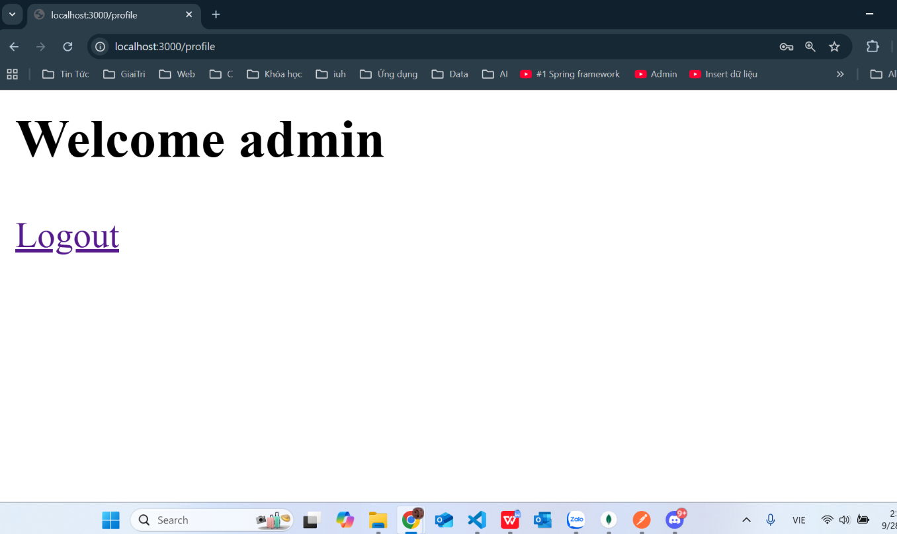

# Local Passport Website

## Cài đặt
1. Clone dự án về máy.
2. Cài đặt các package:
   ```powershell
   npm install express
   ```
3. Đảm bảo MongoDB đang chạy ở địa chỉ `mongodb://127.0.0.1:27017/passportAuth`.

## 1. Khởi động dự án

```powershell
node app.js
```
Server sẽ chạy tại địa chỉ: http://localhost:3000

---

## 2. Đăng ký tài khoản (Register)
Truy cập địa chỉ: `http://localhost:3000/register`
Nhập tên người dùng và mật khẩu, sau đó nhấn Đăng ký.


## 3. Đăng nhập (Login)
Truy cập địa chỉ: `http://localhost:3000/login`
Nhập tên người dùng và mật khẩu, sau đó nhấn Đăng nhập.



---


## 4. Truy cập trang cá nhân (Profile)
Truy cập địa chỉ: `http://localhost:3000/profile`
Chỉ truy cập được khi đã đăng nhập.
![Welcome admin]
---

## 5. Đăng xuất (Logout)
Truy cập địa chỉ: `http://localhost:3000/logout`
Sau khi đăng xuất sẽ chuyển về trang đăng nhập.
![Logout successfully]


**Tác giả:** Nguyễn Ngọc Cẩm Tiên